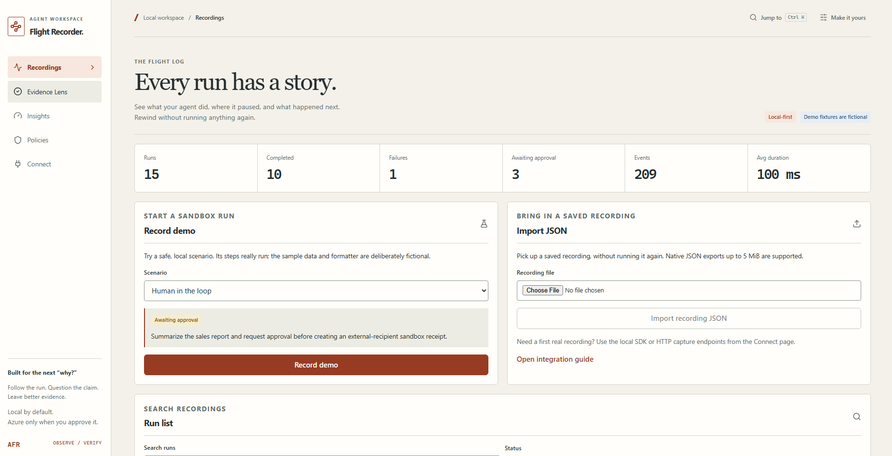

# Agent Flight Recorder

**Follow the run. Question the claim. Leave better evidence.**



Record prompts, explicit decision annotations, model and tool calls, outputs, errors, retries, policy decisions, and human approvals. Inspect the execution timeline, reconstruct state at any event, compare fresh sandbox runs, and export recordings.

The repository contains the React recorder, the **Agent Evidence Lens** browser/VS Code workbench, a Node.js collector, capture SDK, separate encrypted recorder worker, optional live Azure Responses integration, examples, and tests. The original recorder and synthetic evidence examples work without cloud credentials.

The interface has Paper/Graphite themes, three accents, adjustable density and text size, progressive technical detail, reduced motion, keyboard navigation, and mobile layouts.

For a concise presenter overview of the use case, implementation, demo flow, and limitations, read `docs\HACKATHON-PROJECT-BRIEF.md`.

**Start with `docs\TESTING-WALKTHROUGH.md` for the complete click-by-click feature tour and expected results.** `docs\EVIDENCE-LENS.md` maps the revised brief to implementation and describes its boundaries.

## Quick start

Use **Node.js 24** and **npm 11 or later**. Clone the repository, then install and start from its root:

```powershell
git clone https://github.com/swarupecenits/Agent-Flight-Recorder.git
Set-Location .\Agent-Flight-Recorder
npm ci
npm run build
npm start
```

Open **`http://127.0.0.1:4180`**. Leave the terminal running. Stop it with Ctrl+C. On macOS or Linux, enter the cloned directory using your shell and run the same npm commands.

A fresh clone starts with an empty workspace. Click **Record demo** to capture its first real local execution. The application creates `data` as needed; recordings and generated artifacts are intentionally not committed.

### Windows launcher

From the project folder:

```powershell
.\Start-AgentFlightRecorder.ps1
```

The launcher restores declared dependencies if necessary, builds the frontend, and starts the server. An existing database is preserved. For an already-built copy:

```powershell
.\Start-AgentFlightRecorder.ps1 -SkipBuild
```

No Azure subscription, model key, Python package, Docker container, SMTP server, or cloud deployment is required for the local recorder and synthetic Lens examples. Live Azure drafts require an existing deployment and a local key.

### Evidence Lens and VS Code

Open **Evidence Lens** in the browser and try **The code changed after the test**. Expect **Unverifiable**, not a claim that the final code is broken. Review the linked result, inspect the Manifest, approve a bounded mock recovery, and compare the new proof.

For encrypted persistence and real selected-task capture:

```powershell
npm run extension:package
```

Install `artifacts\agent-evidence-lens-0.1.0.vsix` using VS Code's **Extensions: Install from VSIX**, then open the Evidence Lens activity-bar view. This is a local package, not a Marketplace publication.

### Optional real Azure model

Copy `.env.example` to `.env` only if no local `.env` exists, then configure your Azure `/openai/v1` endpoint, deployment, and API key. Set `AFR_ENABLE_FOUNDRY=1` and restart the backend. The key stays server-side; never put it in `VITE_*` variables or commit it.

**Use live Azure** previews synthetic evidence before invoking a real streaming model. **Draft with Azure** previews selected, minimized claim/scope metadata. Model prose is advisory and cannot change deterministic verdicts. `npm run demo:live` runs a small real-model demonstration; it can consume quota.

## What works

| Capability | Implementation |
| --- | --- |
| Real execution capture | A framework-neutral Node SDK wraps actual callbacks. Both the HTTP client and the sandbox runner feed the same validated, persistent event store. |
| Trace inspection | Ordered events, trace/span IDs, nested tool spans, timestamps, measured callback durations, prompts, inputs, outputs, failures, and explicit state changes. |
| Step-by-step replay | Play/pause, stepping, seeking, playback speed, error/policy breakpoints, and a state/payload inspector. Replay never invokes a tool. |
| Explainable policy outcomes | Recorded allow, deny, and approval-required decisions, with the matching rule and reason. |
| Human approval | Inspect the exact message, explicitly approve or reject it, and see the resulting policy and execution events. Duplicate approval clicks cannot repeat delivery. |
| Error debugging | A transient fault recovers on retry; a malformed fixture produces a genuine persistent parse failure. Failed attempts are retained. |
| What-if reruns | Start a new sandbox run with a different scenario, retain its parent link, and compare actual outcomes and metrics. This is distinct from read-only replay. |
| Insights | Failure/retry patterns, policy blocks, approval waits, incomplete spans, redaction notices, and measured slow operations. |
| Persistence | SQLite stores recordings, approval decisions, and local outbox receipts. Pending approvals survive a restart. Interrupted executions are not silently restarted. |
| Export/import | Compact native JSON with chain validation, a Markdown report, and an OTLP/JSON trace projection. Imported recordings are immutable snapshots. |
| External instrumentation | A real HTTP Node SDK example plus a dependency-free Python example. Capture your own agent code without changing the UI. |
| MCP | A stateless Streamable HTTP endpoint with five working read-only tools: list runs, get trace events, replay state, find failures, and compare runs. |
| Evidence validity | Version/scope-bound positive assertions, four explicit verdicts, source links, capture gaps, and required next checks. |
| Run Manifest and handoff | Available versus used inventory; version/source health; evidence-linked summaries and separate reviewed corrections. |
| Encrypted VS Code companion | Separate bundled worker, AES-256-GCM records/artifacts, SecretStorage keys, consent, minimization, reviewed exports and retention. |
| Reviewed recovery | Compatible fixed mock state or a clearly labeled new run; explicit effect/limit review, duplicate protection, parent linkage and before/after evidence comparison. |
| Actual selected tasks | Public VS Code task exit events and bounded before/after Git-visible file hashes. No private terminal or Chat interception. |
| Reviewed workspace rules | A scoped proposed instruction, displayed diff, explicit approval and concurrent-edit protection; no silent learning. |
| Live Azure | Real Responses streaming with measured token/delta/duration metadata, bounded requests, exact previews, opt-in analysis and explicit failures. |

## Try the full workflow

1. On **Recordings**, select **Human in the loop** and click **Record demo**.
2. Inspect the captured prompt, file search, selected report, report read, scripted summary, and external-recipient policy.
3. The run pauses before `SendEmailTool`. No receipt exists yet. Use **Review pending action** in the header to inspect the pending message and policy reason.
4. Use the replay controls to step backward and forward. Inspect **Event payload** and **Recorded state**. Observe that replay does not create a receipt or resolve the approval.
5. Enter a reviewer label, then choose **Approve action**. The run records the human decision, rechecks the exact approved message, executes `SendEmailTool`, and ends.
6. Inspect the **local outbox** receipt. **No actual email was sent.**
7. Export JSON or Markdown. Import the native JSON: an identical existing recording is reopened without overwriting it.
8. Run **Recover from a transient error**, inspect the failure and retry, then run a **Clean baseline** what-if and compare.

The fictional sales fixture produces **$5,000,000 revenue**, **47.1% quarter-over-quarter growth**, and **308 deals**, with North America the largest region. These figures are computed from the fixture at execution time, not inserted as prebuilt trace rows.

### Five scenarios

| Scenario | Expected result | What actually happens |
| --- | --- | --- |
| Human in the loop | Awaiting approval, then completed or blocked | The external-recipient sandbox action waits for an explicit human decision. |
| Recover from a transient error | Completed, one failed attempt and one retry | An explicitly labeled injected exception precedes the first read; the second attempt reads the real file. |
| Policy stops a restricted read | Blocked | The rule prevents the restricted file from being opened. |
| Debug a persistent failure | Failed, two failed read/parse attempts | A deliberately invalid fixture causes real `JSON.parse` errors. |
| Clean baseline | Completed | Search, read, scripted formatting, and an internal-recipient sandbox receipt. |

## Connect your own code

With the recorder running, execute the standalone HTTP SDK example:

```powershell
npm run demo
```

It reads the fixture in a **separate Node process**, captures tool calls through HTTP, prints the recording URL, and saves `artifacts\independent-sdk-recording.json`.

```javascript
import { FlightRecorder } from './sdk/recorder.mjs';

const recorder = new FlightRecorder({ baseUrl: 'http://127.0.0.1:4180' });
await recorder.run({
  name: 'My reporting agent',
  agentName: 'custom-agent',
  input: { prompt: 'Find the report' },
}, async run => {
  await run.prompt('Find the report');
  const result = await run.tool('Lookup', { id: 42 }, async () => ({ answer: 'Found' }));
  await run.decision('Return the observed tool result', { result });
  return result;
});
```

Wrap your actual tool functions and model SDK calls, not just the demonstration callback. See `sdk\README.md` and `docs\API.md`.

The Python example uses only the standard library:

```powershell
python .\examples\capture-python-agent.py
```

MCP clients can connect to **`http://127.0.0.1:4180/mcp`** using Streamable HTTP. This endpoint only reads recordings; it cannot approve actions, rerun agents, or send messages.

## Honest prototype boundaries

- **The included demo agent is scripted local code, not a live LLM.** Its tool invocations, errors, retries, policies, and receipts are real local operations captured by the SDK. The formatter is labeled `ScriptedReportFormatter`, and token usage is unmeasured rather than invented.
- The optional Evidence Lens Azure integration makes real model calls only when configured and approved. The five original report scenarios remain scripted. No hosted Foundry agent is deployed, and a cloud-hosted agent cannot reach loopback MCP without a separate network design.
- A decision event is an explicit developer/agent annotation. The system does **not** access hidden model chain-of-thought or reconstruct unobserved reasoning.
- `SendEmailTool` writes to a local SQLite outbox only. It never contacts Graph, SMTP, or a real recipient. The `.example` domains and all report data are fictional.
- The policy engine controls the included sandbox runner. Instrumenting an external agent records its events; it does not automatically enforce enterprise-wide policies on that agent.
- This is a **single-user, loopback-only prototype**, not a hosted multi-tenant service. Reviewer labels are local audit labels, not authenticated Microsoft identities.
- Per-run write tokens protect capture writes. The client header is a CSRF boundary, **not user authentication**. The original SQLite database and plaintext exports are not encrypted by the app; the VS Code Lens vault is separately encrypted.
- Recursive credential-pattern redaction runs in the Node SDK and collector. It is **best effort, not a DLP guarantee**; inspect recordings before sharing. The lightweight Python example relies on collector-side redaction.
- SHA-256 hash chains detect inconsistent or modified event chains. They are **not digital signatures**: someone who can rewrite the entire file can also recompute its hashes.
- Capture fails explicitly on invalid data or capacity limits. Limits are 500 recordings per database, 1,000 events per recording, 64 KiB per event, and 4 MiB of event data per recording. Two event slots and 128 KiB are reserved for final output/termination. Keep large documents in your own storage and record references or selected excerpts.
- Native JSON import supports this application's version-1 recording format. OTLP is an **export projection**, not an OTLP ingestion server. Approval queues and executable code are not imported.
- Evidence checks operate on explicitly declared positive assertion kinds and scope, not arbitrary natural-language fact checking. Private Copilot panels, hidden reasoning, opaque MCP internals, and arbitrary CLI/Agency exact resume are unavailable.
- The browser Lens is a session preview, not persistent encrypted storage. Use the VS Code companion for that; a lost SecretStorage key cannot decrypt existing records.

## Development

Stop the production launcher before using development mode; both modes use the same default collector port and workspace.

```powershell
npm run dev        # API 4180 and Vite 5180; open http://127.0.0.1:5180
npm run build      # TypeScript and production assets
npm test           # Extension build plus recorder / evidence / encryption / HTTP / worker cases
npm run check      # Production build and Node suite
npm run browser:install # Install the locked Playwright Chromium browser once
npm run test:e2e   # Isolated headless Chromium browser workflows
npm run test:extension # Actual installed VS Code, isolated test profile and synthetic task
npm run extension:package # Produce the local installable VSIX
npm run demo:evidence # Real SDK captures with versioned evidence annotations
npm run demo:evidence-fixtures # Seven synthetic import fixtures
```

Browser tests use an in-memory database and their own ignored output directories. They do not require saved demo recordings or an existing browser profile. `AFR_BROWSER` can override the executable when using an existing Edge or Chromium installation.

On Linux machines that need browser system dependencies, run `npm run browser:install:ci` instead of `npm run browser:install`.

### Dependencies and registries

Dependency versions and integrity hashes are locked in `package-lock.json`. The committed `.npmrc` omits registry-specific tarball URLs so installation can use the contributor's configured registry rather than a particular corporate feed. No registry credentials are stored in the repository.

Use `npm ci` normally. If a managed npm 12 installation reports `EALLOWREMOTE` when an approved registry redirects downloads, use its supported per-command override:

```powershell
npm ci --allow-remote=all --no-audit --no-fund
```

No global npm settings need to be changed. Do not disable TLS validation to work around network or certificate errors.

### Reproduce the presentation workspace

With the server running:

```powershell
npm run demo:prepare
npm run demo:screens
```

Preparation executes the five scenarios and a clean what-if run, approves a separate clearly labeled scripted example, and leaves a fresh presentation approval pending. It preserves existing recordings. The screenshot script only observes the UI; it does not approve or execute actions.
Run `npm run browser:install` before screenshot capture unless `AFR_BROWSER` points to an existing browser.

### Configuration

| Variable / option | Default | Purpose |
| --- | --- | --- |
| `AFR_PORT` / launcher `-Port` | `4180` | Loopback production server port |
| `AFR_DB_PATH` | `data\flight-recorder.sqlite` | Alternate SQLite workspace; never share one database between live recorder processes |
| `AFR_URL` | `http://127.0.0.1:4180` | Collector address used by the standalone examples |
| `AFR_DEV` | unset | Set automatically by the development launcher for the Vite origin |
| `AFR_BROWSER` | Playwright Chromium | Optional browser executable for tests and screenshots |
| `AFR_E2E_PORT` | `4398` | Isolated browser-test server port |
| `AFR_ENABLE_FOUNDRY` | unset/off | Explicitly enable optional live Azure requests |
| `AZURE_OPENAI_BASE_URL` | unset | Existing resource's HTTPS `/openai/v1` endpoint |
| `AZURE_OPENAI_DEPLOYMENT` | unset | Existing model deployment name |
| `AZURE_OPENAI_API_KEY` | unset | Server-only local credential; never exposed to UI/export |
| `AZURE_AI_PROJECT_ENDPOINT` | unset | Optional operator reference; model inference uses the base URL above |
| `VSCODE_EXECUTABLE` | detected on Windows | Installed desktop executable for the isolated extension-host test |

`npm start`, `npm run dev`, and the Node demo helpers load the ignored root `.env`. Existing shell values take precedence, for example `$env:AFR_PORT = '4181'` before `npm start`. Keep `AFR_URL` aligned when changing ports. The PowerShell launcher overrides the environment port only when `-Port` is explicitly supplied.

If a port is occupied, use a different launcher port or stop the specific existing recorder. If a database is already open, use a different database path or stop its owner. The app does not terminate unrelated processes.
When using another port, set `AFR_URL` to that address before running the standalone examples or demo preparation script.
For a portable recording, use JSON export. To move or back up the entire workspace, stop the server first and copy the whole `data` folder; do not remove database sidecar files while the app is running.

## Project map

```text
src\                    React UI and replay workbench
lens\                   Versioned evidence engine, adapters, crypto vault and safe mock recovery
extension\              VS Code controller, separate worker and shared React webview
shared\                 API contracts and pure trace/replay functions
server\                 HTTP collector, SQLite store, policies, demos, MCP, exports
sdk\                    Dependency-free Node capture SDK
examples\               Independent clients and fictional fixture files
test\                   Node unit and HTTP integration cases
e2e\                    Browser workflows
scripts\                Development and browser-test launchers
docs\                   API, architecture, scope mapping, and presenter guide
.github\                CI, dependency updates, and pull request template
data\                   Generated persistent local workspace (ignored)
artifacts\              Generated exports and presentation screenshots (ignored)
Start-AgentFlightRecorder.ps1
```

## Repository workflow

The CI workflow builds and runs the Node suite on Windows and Linux and exercises the browser workflows on Linux. It uses synthetic data, requires no deployment secrets, and does not publish packages or deploy a service. Browser diagnostics are retained only for failed CI jobs.
The Node suite includes the real bundled worker; the desktop VS Code-host test is a separate local command. No live Azure call is made by CI.

`.gitignore` excludes dependency folders, builds, databases, local recordings, exports, browser reports, environment files, credentials, logs, and editor state. Commit source, synthetic fixtures, tests, documentation, and the lockfile; regenerate demo data locally rather than publishing private captures.

See `CONTRIBUTING.md` for contribution steps, `SECURITY.md` for data-handling boundaries, `docs\DEMO.md` for a two-minute presenter walkthrough, and `docs\PROJECT-SCOPE.md` for the project feature mapping.

## License

No open-source license has been selected. The application remains marked `private` in `package.json` to prevent accidental npm publication.
